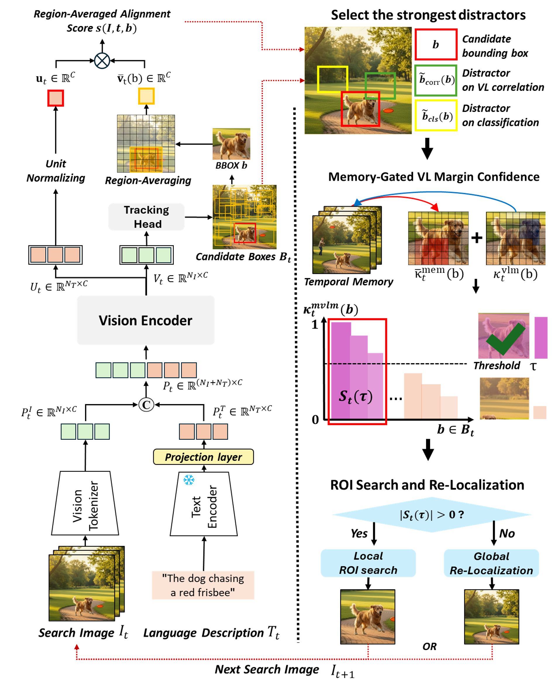

# MVLM: Template-Free Tracking via Vision–Language Margin Confidence and Memory-Gated Tracking

**CVPR 2026** &nbsp;|&nbsp; [Paper](추가예정) &nbsp;|&nbsp; [Project Page](https://mvlm-tft.github.io/)
## Highlights
<p align="center">
  
</p>

- **Template-free tracking**: localizes objects using only natural language — no bounding box or visual template required at initialization
- **MVLM confidence**: fuses VL correlation margins, encoder head predictions, and temporal memory into a single reliable score
- **Memory-gated tracking**: dynamically switches between compact ROI search (high confidence) and global re-localization (low confidence)

## News

- **[2026/05]** Code and models are released.
- **[2026/02]** MVLM accepted to CVPR 2026.

## Main Results

### Tracking-by-Language (no bounding box)

| Method | TNL2K PRE | TNL2K AUC | LaSOT PRE | LaSOT AUC | OTB99 PRE | OTB99 AUC | MGIT PRE | MGIT AUC |
|--------|:---------:|:---------:|:---------:|:---------:|:---------:|:---------:|:--------:|:--------:|
| JointNLT (CVPR'23) | 55.0 | 54.6 | 59.3 | 56.9 | 77.6 | 59.2 | 43.8 | 59.2 |
| UVLTrack-B (AAAI'24) | 57.2 | 55.7 | 61.0 | 57.2 | 79.1 | 60.1 | 44.6 | 56.1 |
| MambaVLT (CVPR'25) | 58.9 | 58.4 | 57.2 | 55.8 | 79.2 | 58.9 | 50.3 | 64.6 |
| **MVLM (Ours)** | **60.9** | **57.8** | **65.5** | **60.7** | **84.3** | **60.7** | **55.5** | **63.5** |

### Tracking-by-BBox + Language

| Method | TNL2K PRE | TNL2K AUC | LaSOT PRE | LaSOT AUC | OTB99 PRE | OTB99 AUC | MGIT PRE | MGIT AUC |
|--------|:---------:|:---------:|:---------:|:---------:|:---------:|:---------:|:--------:|:--------:|
| SUTrack-B224 (AAAI'25) | 67.9 | 65.0 | 80.5 | 73.2 | 93.4 | 70.8 | - | - |
| MambaVLT (CVPR'25) | 69.9 | 66.5 | 71.0 | 66.6 | 94.4 | 72.2 | 58.9 | 69.9 |
| DUTrack-256 (CVPR'25) | 70.6 | 64.9 | 81.1 | 73.0 | 93.9 | 70.9 | - | - |
| **MVLM (Ours)** | **71.4** | **66.3** | 79.3 | 72.0 | 92.3 | 69.7 | **66.3** | **71.7** |

Raw tracking results are available for download: [Google Drive](https://drive.google.com/drive/folders/1JXYv0rECLvdVot4XD9LPHIptT2wfpzD6)

## Installation

```bash
# Clone the repository
git clone https://github.com/inha-vllab/MVLM.git
cd MVLM

# Create conda environment
conda create -n mvlm python=3.8 -y
conda activate mvlm

# Install dependencies
pip install -r requirements.txt

# Configure local dataset and output paths
python tracking/create_default_local_file.py --workspace_dir . --data_dir <path_to_data_root> --save_dir ./output
```

### Demo Web UI Frontend (optional)

The Demo Web UI frontend requires [Node.js](https://nodejs.org/) (v18+) to build:

```bash
cd tracking/web/frontend
npm install
npm run build
cd ../../..
```

## Model

Download the pretrained backbone and place it at `pretrained/itpn/`:

| Backbone | File | Download |
|----------|------|------|
| FastITPN-Base | `fast_itpn_base_clipl_e1600.pt` | [Download](https://github.com/sunsmarterjie/iTPN)

Download MVLM checkpoints:

| Model | Config | Backbone | Download |
|-------|--------|----------|----------|
| MVLM | `mvlm_TF` | FastITPN-B | [Google Drive](https://drive.google.com/file/d/1E1bbSYhfpEjhaas3mu_2XAE14WKUMCUS/view?usp=sharing)

## Data Preparation

Download and organize the following datasets:

- [LaSOT](https://huggingface.co/datasets/l-lt/LaSOT) — with language annotations (nlp.txt)
- [VastTrack](https://github.com/henglan/vasttrack)
- [TNL2K](https://github.com/wangxiao5791509/TNL2K_evaluation_toolkit)
- [OTB99-Lang](https://github.com/QUVA-Lab/lang-tracker)
- [MGIT](http://videocube.aitestunion.com/)

Expected directory layout:

```
/path/to/data/
├── lasot/
│   ├── airplane/
│   │   ├── airplane-1/
│   │   │   ├── img/
│   │   │   ├── groundtruth.txt
│   │   │   └── nlp.txt
│   │   └── ...
│   ├── ...
│   ├── training_set.txt
│   └── testing_set.txt
│
├── vasttrack/
│   └── train/
│       ├── Aardwolf/
│       │   ├── Aardwolf-10/
│       │   │   ├── imgs/
│       │   │   ├── Groundtruth.txt
│       │   │   └── nlp.txt
│       └── ...
│
├── tnl2k/
│   ├── train/
│   │   ├── Arrow_Video_ZZ04_done/
│   │   │   ├── imgs/
│   │   │   ├── groundtruth.txt
│   │   │   └── language.txt
│   │   └── ...
│   └── test/
│       ├── Assian_video_Z03_done/
│       │   ├── imgs/
│       │   ├── groundtruth.txt
│       │   └── language.txt
│       └── ...
│
├── otb99_lang/
│   ├── OTB_videos/
│   │   ├── Basketball/
│   │   │   ├── img/
│   │   │   └── groundtruth_rect.txt
│   │   └── ...
│   └── OTB_query_test/
│       ├── Biker.txt
│       └── ...
│
└── mgit/
    ├── attribute/
    │   ├── groundtruth/
    │   │   ├── 001.txt
    │   │   └── ...
    │   └── ...
    ├── data/
    │   └── test/
    │       ├── 001/
    │       │   ├── frame_001/
    │       │   │   ├── 000000.jpg
    │       │   │   └── ...
    │       └── ...
    └── mgit_nlp/
        ├── 001.xlsx
        └── ...
```

## Training

```bash
# Single GPU
python tracking/train.py \
  --script mvlm \
  --config mvlm_TF \
  --save_dir ./output --mode single

# Multi-GPU (4 GPUs, torch.distributed.launch)
python tracking/train.py \
  --script mvlm \
  --config mvlm_TF \
  --save_dir ./output --mode multiple --nproc_per_node 4

# Multi-GPU (4 GPUs, torchrun)
python tracking/train.py \
  --script mvlm \
  --config mvlm_TF \
  --save_dir ./output --mode multiple --nproc_per_node 4 --launcher torchrun
```

Config files are located in `experiments/mvlm/`. The text encoder (CLIP) is frozen by default during training. Checkpoints are saved without frozen CLIP weights to reduce file size.

## Evaluation

### Step 1: Generate Tracking Results

Three execution modes are available via `--mode`:

| Mode | Launch command | Description |
|------|---------------|-------------|
| `single` | `python` | Sequential on 1 GPU (default) |
| `dist` | `torchrun` | Distributed across GPUs via `torch.distributed` |
| `mp` | `python` | Parallel via `multiprocessing.Pool` |

```bash
# Single GPU (default)
python tracking/test.py mvlm mvlm_TF \
  --dataset_name lasot --weight_path ./models/MVLM_TF.pth.tar --exp_id test_run1

# Multi-GPU with torchrun (dist)
torchrun --nproc_per_node <nproc_per_node> tracking/test.py mvlm mvlm_TF \
  --dataset_name lasot --weight_path ./models/MVLM_TF.pth.tar --num_gpus <num_gpus> --mode dist --exp_id test_run1

# Multi-GPU with multiprocessing (mp)
python tracking/test.py mvlm mvlm_TF \
  --dataset_name lasot --weight_path ./models/MVLM_TF.pth.tar --num_gpus <num_gpus> --threads <num_threads> --mode mp --exp_id test_run1
```

Supported `--dataset_name` values: `tnl2k`, `lasot`, `otb99_lang`, `mgit`.

### Step 2: Compute Metrics (Precision / AUC)

After tracking results are generated, compute PRE, NPR, AUC:

```bash
# --exp_id must match the value used in test.py (results are stored under results_dir/{tracker_name}/{exp_id}/)
python tracking/analysis_results.py \
  --tracker_name mvlm \
  --tracker_param mvlm_TF \
  --exp_id test_run1 \
  --dataset lasot
```

**MGIT submission:** To evaluate MGIT test set performance, submit raw tracking results to [VideoCube Official Platform](http://videocube.aitestunion.com/videocube)

## Demo

### CLI Demo

```bash
# Template-free tracking (language only)
python tracking/demo.py \
  --config mvlm_TF \
  --checkpoint ./models/MVLM_TF.pth.tar \
  --video <path_to_video> \
  --text "the man in white shirt" \
  --skip-selection

# Stream results to web browser
python tracking/demo.py \
  --config mvlm_TF \
  --checkpoint ./models/MVLM_TF.pth.tar \
  --video <path_to_video> \
  --text "the man in white shirt" \
  --skip-selection --no_display --stream_port 8080
# Then open http://localhost:8080 in your browser

# Force CPU inference (no GPU required)
python tracking/demo.py \
  --config mvlm_TF \
  --checkpoint ./models/MVLM_TF.pth.tar \
  --video <path_to_video> \
  --text "the man in white shirt" \
  --skip-selection --device cpu
```

`--skip-selection` enables fully template-free mode. Omit it to select the initial bounding box interactively.

### Web UI

The Demo Web UI provides a browser-based interface for interactive tracking — configure model, video, and text description through the GUI without any CLI parameters.

> **Note:** The frontend must be built before first use. See [Demo Web UI Frontend](#web-ui-frontend-optional) in the Installation section.

```bash
# Start the server (opens at http://localhost:8080)
python tracking/web/api.py

# Force CPU inference
python tracking/web/api.py --device cpu
```

**Workflow:**
1. **Model tab** — Select config (`mvlm_TF` or `mvlm_BBOX`) and checkpoint, then click Load
2. **Video tab** — Enter video path (or upload/URL/webcam), then click Load Video
3. First frame preview appears — optionally drag to select initial ROI
4. Enter target description and click **Start Tracking**
5. **Control tab** — Pause/resume, switch target mid-tracking


## Citation

```bibtex
@inproceedings{park2026mvlm,
  title={MVLM: Template-Free Tracking via Vision--Language Margin Confidence and Memory-Gated Tracking},
  author={Dae-Hyeon Park, Mina Baek, Jeong-Hun Ha, Chan-Seop Park, Jamshidjon Ganiev, Seung-Hwan Bae},
  booktitle={Proceedings of the IEEE/CVF Conference on Computer Vision and Pattern Recognition (CVPR)},
  year={2026}
}
```


<!-- ## License -->

<!-- This project is released under the [MIT License](LICENSE). -->

## Acknowledgements

This codebase builds upon [SUTrack](https://github.com/chenxin-dlut/SUTrack), [FastITPN](https://github.com/sunsmarterjie/iTPN), and [OpenAI CLIP](https://github.com/openai/CLIP). We thank the authors for their excellent work.
